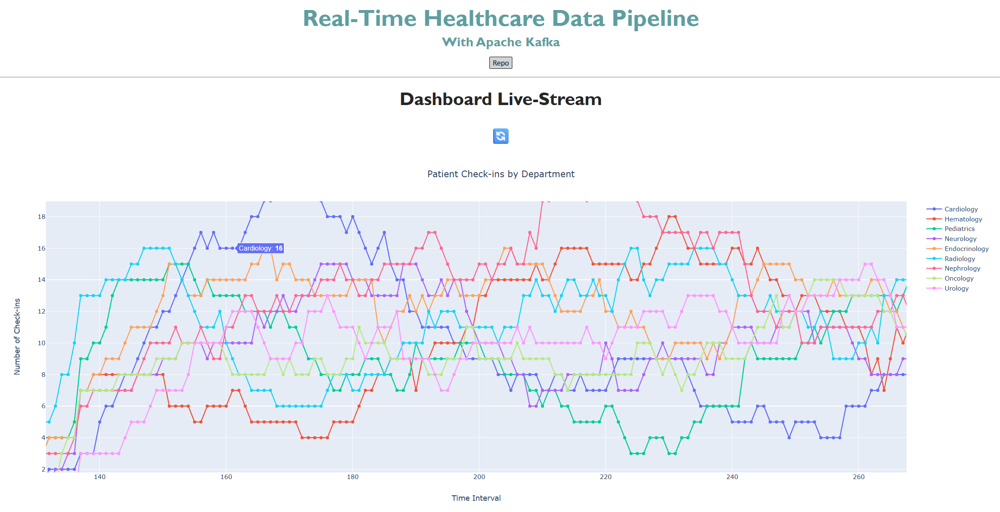

# 📚 Patient Check-In Data Pipeline

## 📝 Description

This project demonstrates a **real-time healthcare data pipeline** using **Apache Kafka** for event streaming, **Python** for data generation and consumption, and **Plotly Dash** for interactive visualization. The simulation generates live patient check-in events from multiple hospital departments (Cardiology, Oncology, Pediatrics), streams them into a Kafka topic, and consumes them to update a live dashboard in real time.  

It showcases how healthcare organizations could use a streaming architecture to monitor operational metrics, detect patterns, and improve decision-making without relying on static batch reports. While this is a simulated dataset, the architecture reflects real-world use cases in **healthcare analytics, streaming data pipelines, and real-time dashboards**.

## 📂 Table of Contents

- [Installation](#installation)
- [Usage](#usage)
- [Methodology](#methodology)
- [Results](#results)
- [Conclusion](#conclusion)
- [License](#license)

## 📦 Installation

To run this project locally, follow these steps:

1. Clone the repository:
    ```bash
    git clone https://github.com/CxLos/Healthcare_Analytics_Architecture
    ```
2. Navigate to the project directory:
    ```bash
    cd Healthcare_Analytics_Architecture
    ```
3. Install the required dependencies:
    ```bash
    pip install -r requirements.txt
    ```

## ▶️ Usage

- This is an interactive Plotly/Dash dashboard that updates in real time.  
- The Kafka **producer** generates synthetic patient check-in events every 2 seconds.  
- The Kafka **consumer** listens to the same topic and pushes updates to the dashboard. 

- To launch the dashboard locally:
    ```bash
    python healthcare_analytics.py
    ```

- Or access the live version here:  
  🌐 [Streaming Patient Check-In Dashboard]()



## 🧪 Methodology

### Data Generation

- Synthetic patient check-ins are created with:

    - `patient_id`: random 4-digit number.
    - `check_in_time`: current timestamp.
    - `department`: randomly selected from `["Cardiology", "Oncology", "Pediatrics"]`.

### Streaming Layer

- **Producer**: Sends JSON-encoded events to Kafka topic `patient_checkins`.
- **Consumer**: Reads events in real time and stores them in a thread-safe queue for visualization.

### Visualization Layer

- **Plotly Dash** app updates every 3 seconds.
- Displays a time-series line chart showing the count of check-ins per department over time.

## Results

### 🔍 Insights

- Demonstrates the low-latency capabilities of Kafka for healthcare operations.
- Simulates departmental workload trends in real time.
- Provides a blueprint for scaling into more complex event-driven healthcare analytics.

## ✅ Conclusion

This project illustrates how Apache Kafka can serve as the backbone for real-time healthcare analytics pipelines. By integrating streaming data with an interactive dashboard, hospitals and clinics can gain instant visibility into patient flow and department activity. The same architecture could be extended to integrate with machine learning models for predictive patient flow management, anomaly detection, or automated alerts.

## 📄 License

MIT License

© 2025 CxLos

Permission is hereby granted, free of charge, to any person obtaining a copy
of this software and associated documentation files (the "Software"), to deal
in the Software without restriction, including without limitation the rights
to use, copy, modify, merge, publish, distribute, sublicense, and/or sell
copies of the Software, and to permit persons to whom the Software is
furnished to do so, subject to the following conditions:

The above copyright notice and this permission notice shall be included in all
copies or substantial portions of the Software.

THE SOFTWARE IS PROVIDED "AS IS", WITHOUT WARRANTY OF ANY KIND, EXPRESS OR
IMPLIED, INCLUDING BUT NOT LIMITED TO THE WARRANTIES OF MERCHANTABILITY,
FITNESS FOR A PARTICULAR PURPOSE AND NONINFRINGEMENT. IN NO EVENT SHALL THE
AUTHORS OR COPYRIGHT HOLDERS BE LIABLE FOR ANY CLAIM, DAMAGES OR OTHER
LIABILITY, WHETHER IN AN ACTION OF CONTRACT, TORT OR OTHERWISE, ARISING FROM,
OUT OF OR IN CONNECTION WITH THE SOFTWARE OR THE USE OR OTHER DEALINGS IN THE
SOFTWARE.