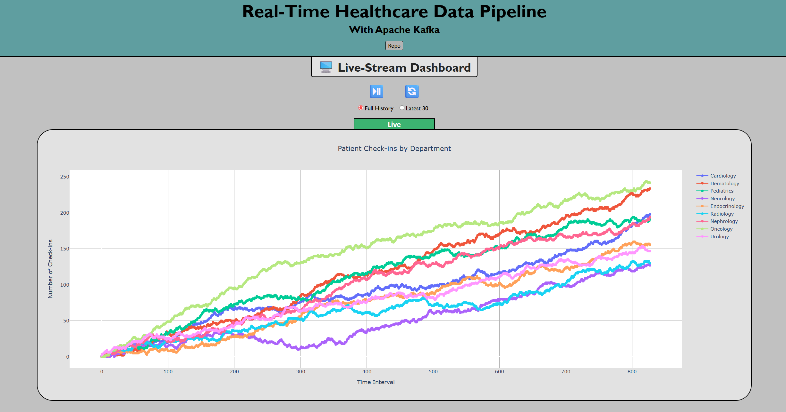

# 📚 Patient Check-In Data Pipeline


## 📝 Description

This project demonstrates a **real-time healthcare data pipeline** using a **background threading architecture**, **Python** for data generation, **OpenAI GPT** for AI-powered summarization, and **Plotly Dash** for interactive visualization. The simulation generates live patient check-in events from multiple hospital departments (Cardiology, Oncology, Pediatrics) via a daemon thread, and updates a live dashboard every 2 seconds.

It showcases how healthcare organizations could use a streaming architecture to monitor operational metrics, detect patterns, and improve decision-making without relying on static batch reports. While this is a simulated dataset, the architecture reflects real-world use cases in **healthcare analytics, real-time dashboards, and AI-assisted reporting**.

## 📂 Table of Contents

- [Installation](#installation)
- [Usage](#usage)
- [Methodology](#methodology)
- [Results](#results)
- [Conclusion](#conclusion)
- [License](#license)

## 📦 Installation

To run this project locally, follow these steps:

1. Clone the repository:
    ```bash
    git clone https://github.com/CxLos/Healthcare_Analytics_Architecture
    ```
2. Navigate to the project directory:
    ```bash
    cd Healthcare_Analytics_Architecture
    ```
3. Create a `.env` file with your OpenAI API key:
    ```bash
    cp .env.example .env
    # then edit .env and set OPENAI_API_KEY
    ```
4. Install the required dependencies:
    ```bash
    pip install -r requirements.txt
    ```

## ▶️ Usage

- This is an interactive Plotly/Dash dashboard that updates in real time.
- A background daemon thread generates synthetic patient check-in events every 2 seconds.
- The dashboard polls the in-memory data store and re-renders charts automatically.

- To launch the dashboard locally:
    ```bash
    python app/healthcare_analytics.py
    ```

- To run the full test suite with coverage:
    ```bash
    pytest
    ```



## 🧪 Methodology

### Data Generation

Synthetic patient check-ins are created with:

- `patient_id`: random 4-digit number
- `check_in_time`: current timestamp
- `department`: randomly selected from `["Cardiology", "Oncology", "Pediatrics"]`
- `complaint`: randomly selected complaint mapped to the chosen department

### Streaming Layer

- A **daemon thread** (`data_generator`) produces one event every 2 seconds into a thread-safe in-memory list (`consumed_data`), guarded by a `threading.Lock`.
- The thread respects a **pause/resume** toggle exposed via the dashboard UI.
- `start_threads_once()` ensures the thread is only started once per process lifetime.

### AI Summarization

- On demand, the dashboard calls **OpenAI GPT-3.5-turbo** via a lazy-initialized client (`_get_client()`) to generate a natural-language summary of current check-in trends.
- Capped at the 100 most recent rows to stay within token limits.

### Visualization Layer

- **Plotly Dash** app updates every 3 seconds via `dcc.Interval`.
- Displays a time-series line chart showing the count of check-ins per department over time.
- Live table shows the most recent 10 check-ins.

### Testing & CI/CD

- **33 tests** across unit, integration, and e2e layers with **100% code coverage**.
- GitHub Actions pipeline: `test → security (Trivy) → deploy (Docker Hub)`.
- Docker image published to `cxlos/healthcare_analytics` on every merge to `main`.

## Results

### 🔍 Insights

- Demonstrates low-latency, thread-safe data ingestion for healthcare operations.
- Simulates departmental workload trends in real time.
- AI summarization layer provides instant narrative insights from live data.
- Provides a blueprint for scaling into more complex event-driven healthcare analytics.

## ✅ Conclusion

This project illustrates how a lightweight threading architecture can serve as the backbone for real-time healthcare analytics pipelines without the operational overhead of a full message broker. By integrating live data generation with an interactive dashboard and AI-powered summarization, hospitals and clinics can gain instant visibility into patient flow and department activity. The same architecture could be extended to integrate with machine learning models for predictive patient flow management, anomaly detection, or automated alerts.

## 📄 License

MIT License

© 2025 CxLos

Permission is hereby granted, free of charge, to any person obtaining a copy
of this software and associated documentation files (the "Software"), to deal
in the Software without restriction, including without limitation the rights
to use, copy, modify, merge, publish, distribute, sublicense, and/or sell
copies of the Software, and to permit persons to whom the Software is
furnished to do so, subject to the following conditions:

The above copyright notice and this permission notice shall be included in all
copies or substantial portions of the Software.

THE SOFTWARE IS PROVIDED "AS IS", WITHOUT WARRANTY OF ANY KIND, EXPRESS OR
IMPLIED, INCLUDING BUT NOT LIMITED TO THE WARRANTIES OF MERCHANTABILITY,
FITNESS FOR A PARTICULAR PURPOSE AND NONINFRINGEMENT. IN NO EVENT SHALL THE
AUTHORS OR COPYRIGHT HOLDERS BE LIABLE FOR ANY CLAIM, DAMAGES OR OTHER
LIABILITY, WHETHER IN AN ACTION OF CONTRACT, TORT OR OTHERWISE, ARISING FROM,
OUT OF OR IN CONNECTION WITH THE SOFTWARE OR THE USE OR OTHER DEALINGS IN THE
SOFTWARE.