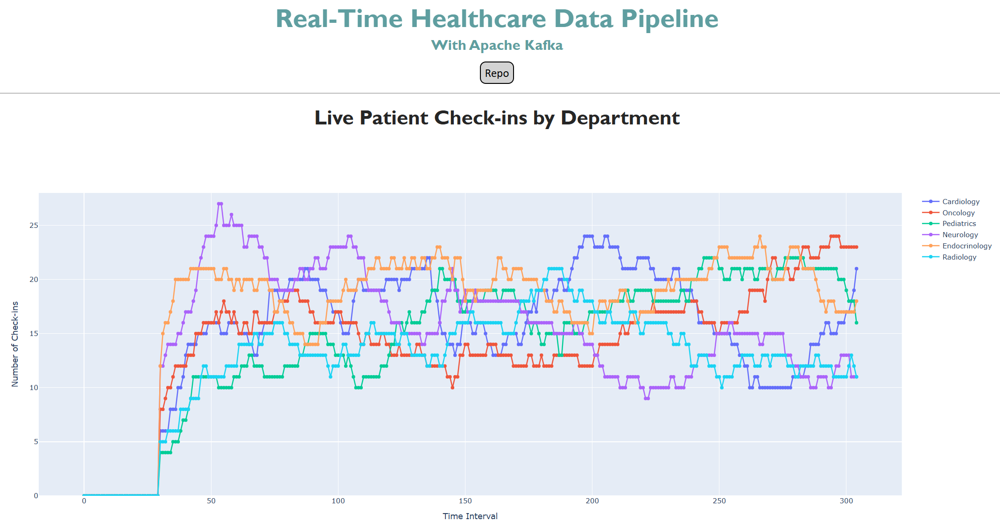

# 📚 Healthcare Analytics Pipeline Simulation

## 📝 Description


## 📂 Table of Contents

- [Installation](#installation)
- [Usage](#usage)
- [Methodology](#methodology)
- [Results](#results)
- [Conclusion](#conclusion)
- [License](#license)

## 📦 Installation

To run this project locally, follow these steps:

1. Clone the repository:
    ```bash
    git clone https://github.com/CxLos/Healthcare_Analytics_Architecture
    ```
2. Navigate to the project directory:
    ```bash
    cd Healthcare_Analytics_Architecture
    ```
3. Install the required dependencies:
    ```bash
    pip install -r requirements.txt
    ```

## ▶️ Usage

- This is an interactive Plotly/Dash dashboard. You can explore different aspects of the data, including class distribution, prediction outcomes, and feature importance. Hover over charts for tooltips and use zoom to inspect data more closely.

- To launch the dashboard locally:
    ```bash
    python healthcare_analytics.py
    ```

- Or access the live version here:  
  🌐 [Healthcare Analytics Architecture]()



## 🧪 Methodology

- Dataset: The dataset was sourced from Kaggle. It contains over 1,000 schools with the following features:

    - 

    - 

    - 

    - 

    - 

    - 

    - 

- **Preprocessing**:

    - Cleaned missing or inconsistent data

    - 

    - 

- **Modeling**:

    - 

    - 

## Results


### 🔍 Insights

- 

- 

-

### 🌟 Feature Importance

1. 

2. 

3. 

4. 

## ✅ Conclusion


## 📄 License

MIT License

© 2025 CxLos

Permission is hereby granted, free of charge, to any person obtaining a copy
of this software and associated documentation files (the "Software"), to deal
in the Software without restriction, including without limitation the rights
to use, copy, modify, merge, publish, distribute, sublicense, and/or sell
copies of the Software, and to permit persons to whom the Software is
furnished to do so, subject to the following conditions:

The above copyright notice and this permission notice shall be included in all
copies or substantial portions of the Software.

THE SOFTWARE IS PROVIDED "AS IS", WITHOUT WARRANTY OF ANY KIND, EXPRESS OR
IMPLIED, INCLUDING BUT NOT LIMITED TO THE WARRANTIES OF MERCHANTABILITY,
FITNESS FOR A PARTICULAR PURPOSE AND NONINFRINGEMENT. IN NO EVENT SHALL THE
AUTHORS OR COPYRIGHT HOLDERS BE LIABLE FOR ANY CLAIM, DAMAGES OR OTHER
LIABILITY, WHETHER IN AN ACTION OF CONTRACT, TORT OR OTHERWISE, ARISING FROM,
OUT OF OR IN CONNECTION WITH THE SOFTWARE OR THE USE OR OTHER DEALINGS IN THE
SOFTWARE.